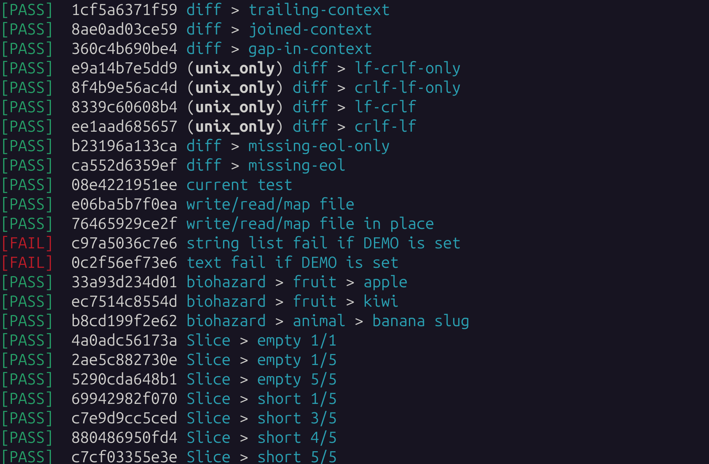
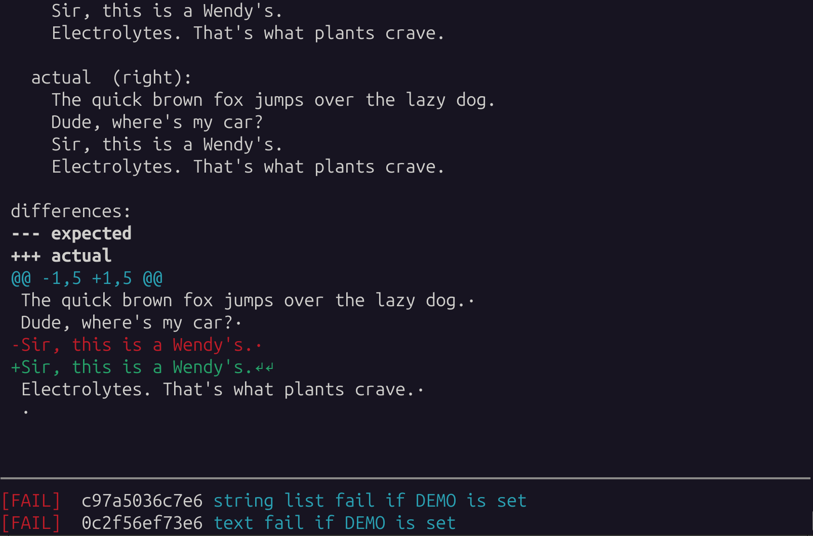

% Testo documentation

Testo is a test framework suitable for unit-testing OCaml code
and for end-to-end testing command-line executables. It is an open-source
project initiated by [Martin Jambon](https://www.linkedin.com/in/mjambon/)
at [Semgrep](https://semgrep.dev/).

* [Getting Started with Testo: A Hands-On Tutorial](tutorial)
* [Testo Howtos: Practical Guides and Examples](howtos)
* [API reference](reference/testo/Testo/index.html)
* Command-line help:
  - [`--help`](cli-reference/help.html)
  - [`run --help`](cli-reference/run-help.html)
  - [`status --help`](cli-reference/status-help.html)
  - [`approve --help`](cli-reference/approve-help.html)
  - [`show-tags --help`](cli-reference/show-tags-help.html)
* [Contributing: source code and issue tracking on GitHub](https://github.com/semgrep/testo)

  

_A successful test run_

  

_The output of `./test status`_

  

_A test failure showing a CRLF issue_
